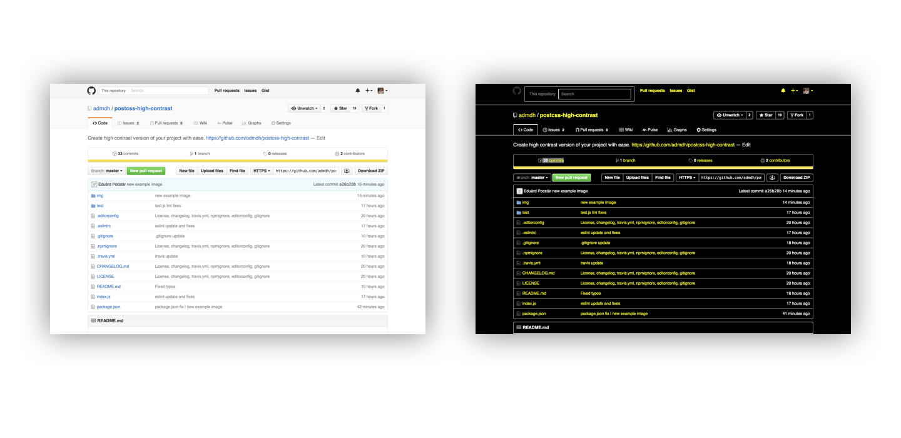

[](https://travis-ci.org/iamfrntdv/postcss-high-contrast)
# PostCSS High Contrast


PostCSS High Contrast is PostCSS plugin that helps automatically convert all colors to high contrast. This Plugin gives you ability to create high contrast version of your project with ease.

## Why?
Accessible websites are getting more popular. Some countries even pass laws obliging IT companies create high contrast versions of their projects. Creating high contrast version of your project due some reasons can be painful.


## Live Example



## Basic Usage
```js
postcss([
	require('postcss-high-contrast')({
		aggressiveHC: true,
		aggressiveHCDefaultSelectorList: ['h1', 'h2', 'h3', 'h4', 'h5', 'h6', 'p', 'li', 'th', 'td'],
		aggressiveHCCustomSelectorList: ['div', 'span'],

		backgroundColor: '#000',
		altBgColor: '#fff',

		textColor: '#fff',

		buttonSelector: ['button'],
		buttonColor: '#000',
		buttonBackgroundColor: '#fcff3c',
		buttonBorderColor: 'none',

		linkColor: '#fcff3c',
		linkHoverColor: '#fcff3c',

		borderColor: '#fff',
		disableShadow: true,

		imageFilter: 'invert(100%)',
		imageSelectors: ['img'],

		removeCSSProps: false,
        CSSPropsWhiteList: ['background', 'background-color', 'color', 'border', 'border-top', 'border-bottom',
            'border-left', 'border-right', 'border-color', 'border-top-color', 'border-right-color',
            'border-bottom-color', 'border-left-color', 'box-shadow', 'filter', 'text-shadow']
	})
]);

```
## How It works?
#### None Aggressive Mode
PostCSS High Contrast plugin will find all colors and replace them to high contrast ones.
input.css:
```css
body {
	background: #fff;
	color: #000;
}

a {
	color: #0b39e1;
}
```
output.css:
```css
body {
	background: #000;
	color: #fff;
}

a {
	color: #fcff3c;
}
```
#### Aggressive Mode
In addition to replacing colors to high contrast colors, there is "Aggressive Mode". "Aggressive Mode" (```aggressiveHC```) is enabled by default. If selector doesn't have ```color``` property it will automatically append it for increasing specificity and providing more accurate results.
input.css:
```css
h1 {
	font-size: 48px;
	margin: 0;
	padding: 0 24px;
	width: 100%;
}

p {
	font-size: 48px;
	margin: 0 0 24px;
}
```
output.css:
```css
h1 {
	color: #fff;
	font-size: 48px;
	margin: 0;
	padding: 0 24px;
	width: 100%;
}

p {
	color: #fff;
	font-size: 48px;
	margin: 0 0 24px;
}
```
Use ```aggressiveHCDefaultSelectorList``` and ```aggressiveHCCustomSelectorList``` to define own lists of properties.

#### Removing Unused CSS
For better css optimization there is an option to remove unused css.
input.css:
 ```css
 h1 {
 	font-size: 48px;
 	margin: 0;
 	padding: 0 24px;
 	width: 100%;
 }

 p {
 	font-size: 48px;
 	margin: 0 0 24px;
 }
 ```
 output.css:
 ```css
 h1 {
 	color: #fff;
 }

 p {
 	color: #fff;
 }
 ```
 For merging CSS selectors use CSS minifiers like [CSSNano](https://github.com/ben-eb/cssnano) or [CSSO](https://github.com/css/csso).
 If you are using PostCSS High Contrast Plugins with some other PostCSS Plugins like [PostCSS Increase Text Sizes](https://github.com/admdh/postcss-increase-text-sizes) you might need some other properties to remain. For this case there is ```CSSPropsWhiteList``` option that prevents from deleting css properties:
 ```
 CSSPropsWhiteList: ['background', 'background-color', 'color', 'border', 'border-top', 'border-bottom', 'border-left', 'border-right', 'border-color', 'border-top-color', 'border-right-color', 'border-bottom-color', 'border-left-color', 'box-shadow', 'filter', 'text-shadow']
 ```

#### WARNING!
```removeCSSProps``` also can remove css properies generated by PostCSS High Contrast. To Prevent this use ```CSSPropsWhiteList```!


#### Appending to wepbage
Using this plugin it's better to generate new high contrast version of css file. Than it is very easy to add/append high contrast version css to a webpage using JavaScript.
JQuery example:
```js
function appendHighContrastCss(){
	var hc = '<link rel="stylesheet" href="/assets/css/high-contrast.css" id="hccss"/>';

	if(!$('#highContrastCss').length ){
		$('head').append(hc);
	} else {
		$('#hccss').remove();
	}
}

$('a.high-contrast').click(loadHighContrastCSS);
	appendHighContrastCss();
}
```
Tip: use cookies to remember turned on high contrast css on different sessions and pages.


## Options
| Name                              | Default Value                                      | Description    |
|:----------------------------------|:---------------------------------------------------|:---------------|
| `aggressiveHC`                    | `true`                                             | Will append properties even if they do not exist |
| `aggressiveHCDefaultSelectorList` | `['h1', 'h2', 'h3', 'h4', 'h5', 'h6',
'p', 'li', 'th', 'td']` | Default list of selectors for aggressive property append |
| `aggressiveHCCustomSelectorList`  | `['span']`                                         | Custom list of selectors for aggressive property append |
| `backgroundColor`                 | `#000`                                             | Backgound color |
| `altBgColor`                      | `#fff`                                             | Alternative background color |
| `textColor`                       | `#fff`                                             | Text color |
| `buttonSelector`                  | `[button]`                                         | Button Selector |
| `buttonColor`                     | `#000`                                             | Button color |
| `buttonBackgroundColor`           | `#fcff3c`                                          | Button background color |
| `buttonBorderColor`               | `none`                                             | Button border color |
| `linkColor`                       | `#fcff3c`                                          | Link color |
| `linkHoverBgColor`                | `#fff`                                             | Link hover bacground color |
| `linkHoverColor`                  | `#000`                                             | Link hover color |
| `borderColor`                     | `#fff`                                             | Border color |
| `disableShadow`                   | `true`                                             | Disable shadow |
| `imageFilter`                     | `false`/`invert(100%)`/`grayscale(100%)`/`contrast(200%)`     | Image Filter (disabled by default). `false` to disable. Any css filter option can be passed|
| `imageSelectors`                  | `['img']`                                           | Default list of image selectors to apply `imageFilter`|
| `removeCSSProps`                  | `false`                                             | This option will remove all unused CSS selectors or properties for better optimization. Use CSS minifiers like CSSNano or CSSO to merge selectors|
| `CSSPropsWhiteList`               | `['background', 'background-color', 'color', 'border', 'border-top', 'border-bottom', 'border-left', 'border-right', 'border-color', 'border-top-color', 'border-right-color', 'border-bottom-color', 'border-left-color', 'box-shadow', 'filter', 'text-shadow']`       | CSS properties whitelist |


## Used by
[Magyar Posta](https://www.posta.hu)

## Works great with:
[PostCSS Increase Text Sizes](https://github.com/admdh/postcss-increase-text-sizes)
